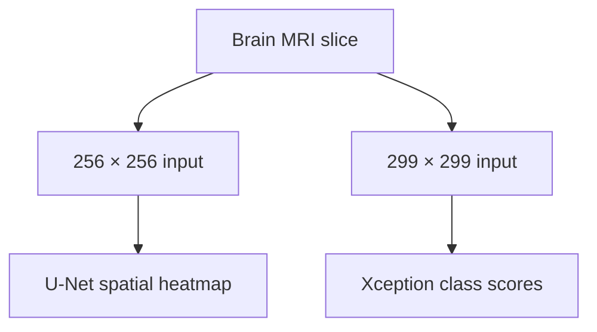

<p align="center"></p>
<p align="center">
<a href="https://doi.org/10.1109/IICAIET67254.2025.11264978"></a>
<a href="https://neuro-vista-mri-private.vercel.app"></a>
</p>

<h1 align="center">NeuroVista MRI</h1>
<p align="center"><b>Brain MRI analysis. From spatial detail to class-level insight.</b><br>A research portfolio by <a href="https://github.com/rifat-binreza">Rifat Bin Reza</a><br>Electrical and Electronic Engineering · BRAC University</p>

<p align="center"><a href="https://neuro-vista-mri-private.vercel.app">Launch demo</a> · <a href="#research-results">Research results</a> · <a href="docs/methodology.md">Methodology</a> · <a href="#publication">Publication</a> · <a href="docs/code-guide.md">Code guide</a></p>

## Overview

NeuroVista MRI brings together **U-Net segmentation**, **Xception classification** and the study of **LoRA-driven synthetic data augmentation** for brain MRI analysis. This repository presents my research portfolio around published IEEE IICAIET 2025 work, with an interactive research application and documented Python reference modules.

The project explores two complementary tasks: localizing image regions through segmentation and producing four-class scores for **Glioma, Meningioma, No Tumor and Pituitary**. The augmentation experiments investigate recovery of classification performance when individual classes are underrepresented.

## Explore the application

**[Open NeuroVista MRI →](https://neuro-vista-mri-private.vercel.app)**

Upload a de-identified grayscale brain MRI slice as PNG or JPEG under **2 MB**, confirm permission and select **Run research analysis**. The workspace provides:

- An MRI preview and adjustable segmentation heatmap.
- Four-class research scores, with ambiguous results withheld.
- Basic input checks and clear unsupported-input messages.
- A downloadable research result and publication explorer.

The first analysis may take longer while the models load. Sign in to Vercel if prompted.

## Research results

| Experiment | Paper-reported result |
| :--- | ---: |
| U-Net segmentation — Dice | **88.43%** |
| U-Net segmentation — IoU | **84.21%** |
| Glioma classification — original dataset | **96.23%** |
| Glioma classification — reduced dataset | **92.88%** |
| Glioma classification — LoRA-augmented dataset | **95.53%** |

The paper abstract reports average improvements over reduced datasets of **2.55% accuracy, 2.38% precision, 2.37% recall and 2.51% F1-score**. These are publication results, not newly reproduced deployment benchmarks. See [reported results](docs/paper-results.csv) and [methodology](docs/methodology.md).

## Analysis pipeline



The two inference branches process the image independently. LoRA augmentation is part of the training experiments.

## Python reference code

The public modules document the methods and selected inference behavior. They were reconstructed from the supplied research materials; they are not a recovered copy of the complete original training implementation.

| Component | Purpose |
| :--- | :--- |
| [Preprocessing](neurovista/preprocessing.py) | Image preparation and binary-annotation handling |
| [U-Net](neurovista/unet.py) | Configurable reference architecture and soft Dice loss |
| [Xception](neurovista/xception.py) | Backbone and four-class classification head |
| [Metrics](neurovista/metrics.py) | Dice, IoU, precision, recall and F1 |
| [Experiments](neurovista/experiments.py) | Classification conditions and class weighting |
| [Augmentation utilities](neurovista/lora.py) | Adapter provenance and augmentation planning |
| [Inference](neurovista/inference.py) | Local classification with trusted caller-supplied models |
| [Input adapter](neurovista/hf_compatibility.py) | Consistent JPEG/PNG conversion and verified class mapping |

```sh
python -m pip install -r requirements.txt
python -m examples.inspect_plan
python -m unittest discover -s tests -v
```

The reference tests run without TensorFlow or model downloads. Model construction requires TensorFlow. See the [code guide](docs/code-guide.md), [reproducibility notes](docs/reproducibility.md) and [inference implementation notes](docs/inference-notes.md) for technical details.

## Publication

**Deep Learning for Brain Tumor Detection: U-Net Segmentation and Xception Classification with LoRA-Driven Synthetic Data Augmentation**  
2025 IEEE International Conference on Artificial Intelligence in Engineering and Technology (**IICAIET**)

**DOI:** [10.1109/IICAIET67254.2025.11264978](https://doi.org/10.1109/IICAIET67254.2025.11264978)

Complete publication attribution is available in [CITATION.cff](CITATION.cff) and [BibTeX](citation.bib).

**Connect:** [Rifat Bin Reza on GitHub](https://github.com/rifat-binreza) · [Google Scholar](https://scholar.google.com/citations?user=U7HsBd4AAAAJ&hl=en)

## Research use and access

NeuroVista MRI is a research demonstration. Scores are not calibrated disease probabilities, and the heatmap is not a validated tumor boundary. Basic input checks cannot verify every image's suitability. Do not submit identifiable patient information or use the application for clinical decisions.

The public repository includes reference modules, documentation and citation metadata. Model weights, private download pointers and deployment internals remain private. See [access policy](docs/access-and-rights.md) and [RIGHTS.md](RIGHTS.md) for reuse terms.
