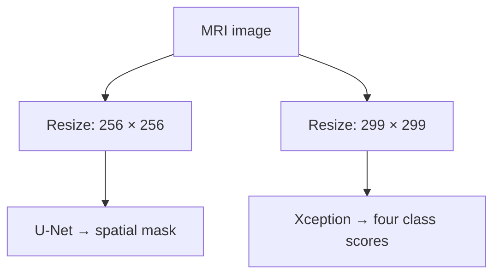

 

<h1 align="center">NeuroVista MRI</h1>

<b>Localize the tumor. Classify the image. Study the imbalance.</b> A personal research showcase by <a href="https://github.com/rifat-binreza">Rifat Bin Reza</a>, co-author of published IEEE IICAIET 2025 research.

<a href="#published-evidence">Results</a> · <a href="docs/methodology.md">Methodology</a> · <a href="docs/reproducibility.md">Reproducibility</a> · <a href="#publication--credit">Publication</a> · <a href="docs/access-and-rights.md">Access & rights</a>

## The research

Brain MRI analysis brings together two questions: **where is the predicted tumor region, and which class does the image resemble?** Our published work studies U-Net segmentation and Xception classification, with LoRA-driven synthetic augmentation to address class imbalance.

NeuroVista MRI presents that research under my own portfolio identity while crediting the complete author team. The accompanying interface is designed around an MRI workspace, segmentation overlays, four-class scores and a publication explorer.

> **Release status:** Research documentation prepared; the new demo is not yet deployed. Real inference requires verified model checkpoints and a connected private inference service. No live-demo link is claimed here.

## Published evidence

| Experiment | Paper-reported result |
| :--- | ---: |
| U-Net segmentation — Dice | **88.43%** |
| U-Net segmentation — IoU | **84.21%** |
| Glioma classification — original dataset | **96.23%** |
| Glioma classification — reduced dataset | **92.88%** |
| Glioma classification — LoRA-augmented dataset | **95.53%** |

The abstract reports average improvements over reduced datasets of **2.55% accuracy, 2.38% precision, 2.37% recall and 2.51% F1-score**. Values preserve the abstract’s wording; they are not newly reproduced benchmarks. See [machine-readable results](docs/paper-results.csv).

## How the supplied demo operates

The supplied inference code runs the two branches independently. It does **not** pass the segmentation mask into Xception. LoRA augmentation belongs to the paper’s training experiments; it is not a live generation feature in this interface.

## A deliberate public release

This repository contains the research story, original vector artwork, citation metadata, documented results and release boundaries. Training notebooks, application internals, model weights and direct model-download links remain outside this public repository.

| Included here | Kept private |
| :--- | :--- |
| Publication and complete author credit | Original notebooks |
| Methodology and reported metrics | Model checkpoints and download pointers |
| Reproducibility and evidence notes | Backend and deployment implementation |
| Citation and access policy | Secrets and access keys |

The implementation package adds bounded image validation, a server-side proxy, access-controlled inference, request isolation and an explicit unavailable state. These engineering checks do not constitute clinical validation or reproduction of the paper.

## Publication & credit

**Deep Learning for Brain Tumor Detection: U-Net Segmentation and Xception Classification with LoRA-Driven Synthetic Data Augmentation**  
2025 IEEE International Conference on Artificial Intelligence in Engineering and Technology (**IICAIET**)

1. Md. Muhaimenul Haque Prottoy — Jashore University of Science and Technology
2. **Rifat Bin Reza — Department of Electrical and Electronic Engineering, BRAC University**
3. Shahriar Islam — Islamic University of Technology
4. Md. Mahfujul Haque — BRAC University
5. Nafiz Ahmed Rhythm — BRAC University

**DOI:** [10.1109/IICAIET67254.2025.11264978](https://doi.org/10.1109/IICAIET67254.2025.11264978)  
**My role in the author list:** second author. The publication is collaborative work; the NeuroVista MRI identity is my personal presentation of it.

Use [CITATION.cff](CITATION.cff) or [BibTeX](citation.bib) to cite the paper. For research inquiries, reach me through [my GitHub profile](https://github.com/rifat-binreza) or explore [my Google Scholar profile](https://scholar.google.com/citations?user=U7HsBd4AAAAJ&hl=en).

## Responsible interpretation

This is a research demonstration, not a diagnostic system. Model scores are not calibrated probabilities of disease. Clinical use, external generalization and regulatory readiness are not established by this release. Do not submit identifiable patient information.

## Rights

No open-source license is granted for the unpublished implementation or models. See [RIGHTS.md](RIGHTS.md). The IEEE publication and third-party materials retain their respective rights; the full paper is not redistributed here.
