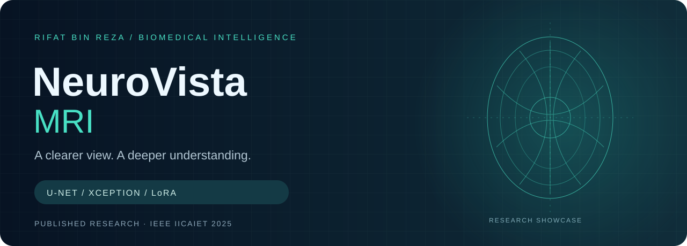
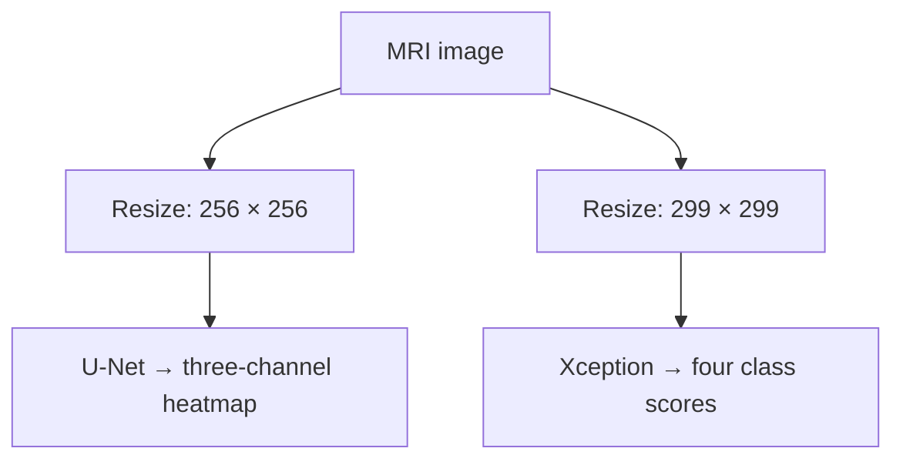

<p align="center"></p>
<p align="center"><a href="https://doi.org/10.1109/IICAIET67254.2025.11264978"></a> </p>

<h1 align="center">NeuroVista MRI</h1>
<p align="center"><b>Localize the tumor. Classify the image. Study the imbalance.</b><br>A personal research showcase by <a href="https://github.com/rifat-binreza">Rifat Bin Reza</a>, co-author of published IEEE IICAIET 2025 research.</p>

<p align="center"><a href="#published-evidence">Results</a> · <a href="docs/methodology.md">Methodology</a> · <a href="docs/reproducibility.md">Reproducibility</a> · <a href="#publication--credit">Publication</a> · <a href="docs/access-and-rights.md">Access & rights</a></p>

## The research

Brain MRI analysis brings together two questions: **where is the predicted tumor region, and which class does the image resemble?** Our published work studies U-Net segmentation and Xception classification, with LoRA-driven synthetic augmentation to address class imbalance.

NeuroVista MRI is my personal research portfolio for brain MRI analysis. The accompanying interface is designed around an MRI workspace, segmentation overlays, four-class scores and a publication explorer.

> **Live research demo:** [Open NeuroVista MRI](https://neuro-vista-mri-private.vercel.app) — deployed on Vercel under Rifat1 with the supplied trained checkpoints. Upload a de-identified PNG/JPEG under 2 MB, confirm permission, then select **Run research analysis**. No separate demo key is required; sign in to Vercel if prompted. First use may take longer while models load.

## Explore the Python implementation

These are **new reference implementations reconstructed from the supplied notebooks and thesis**, not recovered original training code. They make the methods inspectable without exposing the complete application, model weights or private download links.

| Module | What it implements |
|---|---|
| [`preprocessing.py`](neurovista/preprocessing.py) | RGB conversion, resizing, normalization and binary-mask preparation |
| [`unet.py`](neurovista/unet.py) | Configurable reference U-Net and soft Dice loss |
| [`xception.py`](neurovista/xception.py) | Xception backbone and four-class classification head |
| [`metrics.py`](neurovista/metrics.py) | Dice, IoU, confusion matrix, precision, recall and F1 |
| [`experiments.py`](neurovista/experiments.py) | All 21 thesis classification conditions and class weighting |
| [`lora.py`](neurovista/lora.py) | Adapter provenance checks, file hashing and augmentation deficit planning |
| [`inference.py`](neurovista/inference.py) | Local inference with caller-supplied models and verified class order |
| [`hf_compatibility.py`](neurovista/hf_compatibility.py) | Gradio-compatible JPEG/PNG preprocessing and corrected reference label mapping |

```sh
python -m pip install -r requirements.txt
python -m examples.inspect_plan
python -m unittest discover -s tests -v
```

The plan and tests run without TensorFlow or model downloads. Model construction requires TensorFlow. Read the [code guide](docs/code-guide.md) and [source-to-code decisions](docs/source-to-code.md) before using a checkpoint. LoRA training is not falsely represented as reconstructed: essential adapter settings are absent.

## Published evidence

| Experiment | Paper-reported result |
| :--- | ---: |
| U-Net segmentation — Dice | **88.43%** |
| U-Net segmentation — IoU | **84.21%** |
| Glioma classification — original dataset | **96.23%** |
| Glioma classification — reduced dataset | **92.88%** |
| Glioma classification — LoRA-augmented dataset | **95.53%** |

The abstract reports average improvements over reduced datasets of **2.55% accuracy, 2.38% precision, 2.37% recall and 2.51% F1-score**. Values preserve the abstract’s wording; they are not newly reproduced benchmarks. See [machine-readable results](docs/paper-results.csv).

## How the supplied demo operates



The supplied inference code runs the two branches independently. It does **not** pass the segmentation mask into Xception. LoRA augmentation belongs to the paper’s training experiments; it is not a live generation feature in this interface.

The deployed checkpoints were loaded and tested through the live API with a synthetic fixture on 8 October 2026. The request returned four finite class scores and a PNG heatmap; this checks execution, not diagnostic accuracy. Segmentation produces three sigmoid channels. The app preserves the supplied notebook’s OpenCV JET visualization rather than claiming a validated binary boundary or assigning tumor labels to those channels. Class output order is Glioma, Meningioma, No Tumor, Pituitary, matching the [original deployed app source](https://huggingface.co/spaces/prottoymmh/Brain_Tumor_MRI_Detection/blob/main/app.py). The supplied notebook swapped the last two labels; that mapping error was corrected. Both checkpoint SHA-256 hashes match the original app’s Hugging Face model files. Independent training-label metadata remains unavailable.

## A deliberate public release

This repository contains documented Python reference modules, the research story, original vector artwork, citation metadata and reported results. Training notebooks, application internals, model weights and direct model-download links remain outside this public repository.

| Included here | Kept private |
| :--- | :--- |
| Documented Python reference modules | Original notebooks |
| Methodology and reported metrics | Model checkpoints and download pointers |
| Reproducibility and evidence notes | Backend and deployment implementation |
| Citation and access policy | Secrets and access keys |

The implementation package adds bounded image validation, a private Python inference endpoint, checkpoint integrity checks, request isolation and an explicit unavailable state. These engineering checks do not constitute clinical validation or reproduction of the paper.

## Publication & credit

**Deep Learning for Brain Tumor Detection: U-Net Segmentation and Xception Classification with LoRA-Driven Synthetic Data Augmentation**  
2025 IEEE International Conference on Artificial Intelligence in Engineering and Technology (**IICAIET**)

**Rifat Bin Reza** · Electrical and Electronic Engineering, BRAC University  
This repository presents my research portfolio and a documented reconstruction of the MRI analysis workflow. The complete publication attribution is preserved in the citation files.

**DOI:** [10.1109/IICAIET67254.2025.11264978](https://doi.org/10.1109/IICAIET67254.2025.11264978)

Use [CITATION.cff](CITATION.cff) or [BibTeX](citation.bib) to cite the paper. For research inquiries, reach me through [my GitHub profile](https://github.com/rifat-binreza) or explore [my Google Scholar profile](https://scholar.google.com/citations?user=U7HsBd4AAAAJ&hl=en).

## Matching the original Hugging Face workflow

The documented [public compatibility adapter](neurovista/hf_compatibility.py) and [regression tests](tests/test_hf_compatibility.py) are included. Use `prepare_reference_input(path)` with your trusted model, or `classify_reference(path, model)` for the reference checkpoint’s verified output order. The existing generic `inference.py` remains available for other caller-verified models.

The shared input decoder matches Gradio 5.37.0’s `Image(type="filepath", image_mode="RGB")` behavior. RGB files pass through; other modes are converted to RGB. Grayscale JPEG conversion triggers a second JPEG encode in the original app, so the compatibility path reproduces that step in memory. PNG conversion is lossless. This applies to all supported uploads, with no filename-specific rules or score adjustments.

Independent comparisons against the actual Gradio component produced identical model-input tensors across eight cases covering grayscale/RGB JPEG, PNG, alpha and EXIF orientation. The supplied comparison JPEG produced 99.7326% for the No Tumor class when decoded directly and 99.8394% after the reference conversion, explaining the displayed 99.73% versus 99.84% difference. Both checkpoint hashes match the original. Matching software behavior does not establish clinical correctness.

## Input screening and uncertain results

The demo rejects obvious color images, blank/low-contrast images, tiny inputs and extreme aspect ratios before running the models. You must confirm that the input is an original, de-identified brain MRI slice. Rejected inputs show no class scores or heatmaps.

Ambiguous classifier outputs are withheld when the top score is below 0.70 or the top-two margin is below 0.20. These are **uncalibrated display-policy thresholds**, not validated clinical confidence or an out-of-distribution detector. High scores do not prove that an image is an MRI. Grayscale photos, CT images and diagrams may pass the basic checks; do not convert photos to grayscale to bypass them.

Deployment regression checks confirmed that the supplied portrait example is rejected (HTTP 422, no predictions) and an MRI example from the supplied notebook reaches inference. Eight policy/API tests passed. These limited checks do not establish diagnostic accuracy or MRI-detection sensitivity/specificity.

## Responsible interpretation

This is a research demonstration, not a diagnostic system. Model scores are not calibrated probabilities of disease. Clinical use, external generalization and regulatory readiness are not established by this release. Do not submit identifiable patient information.

## Rights

No open-source license is granted for the unpublished implementation or models. See [RIGHTS.md](RIGHTS.md). The IEEE publication and third-party materials retain their respective rights; the full paper is not redistributed here.
